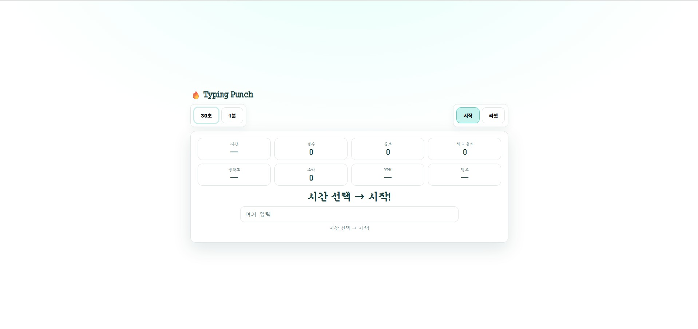

# 🔥 Typing Punch

민트 테마 기반의 웹 타자 게임입니다.
타이핑 정확도와 속도를 동시에 연습할 수 있는 미니 프로젝트입니다.

---

## 🌐 배포 주소

Vercel을 통해 배포되었습니다
👉 https://typing-punch-game.vercel.app/

---

## ✨ 주요 기능

- 30초 / 1분 타이핑 모드
- 실시간 점수 / 콤보 / 최고 콤보 표시
- 정확도 / WPM / 랭크 계산
- 한글 IME 입력 대응
- 연속 단어 방지 로직
- 결과 모달 표시
- 플레이 기록 localStorage 저장
- 민트 테마 UI
- Seogung 폰트 적용

---

## 🖥 미리 보기



## 📁 프로젝트 구조

```
typing-punch/
 ├ index.html
 ├ style.css
 ├ script.js
 ├ words.js
 └ README.md
```

---

## 🚀 실행 방법 (로컬)

별도 설치 없이 바로 실행 가능합니다.

##### 방법 1

- index.html 더블 클릭

##### 방법 2 (VS Code 추천)

- Live Server 사용

---

## 🛠 사용 기술

- HTML
- CSS
- Vanilla JavaScript
- localStorage

---

## 🎮 게임 방법

- 단어를 정확히 입력하면 점수 +1
- 오타 시 콤보 초기화
- 시간 종료 시 결과 모달 표시
- 랭크 기준:

```
Rank	Accuracy	WPM
S	97% 이상	32 이상
A	94% 이상	25 이상
B	90% 이상	18 이상
C	그 외
```

---

## 🌱 목적

- 타자 실력 향상
- DOM 조작 연습
- 게임 로직 구현
- UI 스타일링 연습

## 📌 앞으로 추가해보고 싶은 기능

- HIT 애니메이션
- 콤보 이펙트
- 키 입력 사운드
- 난이도 선택

## 🙋‍♀️ 제작자 GitHub

https://github.com/sungminjung066-lang
